# P0.4 release dependency gates (review plan only)

No S1/W1/S2 commits or workflow dispatches were performed. Local WORKTREE bundles have source_scope=LOCAL_CANDIDATE and published commit fields null. They cannot be uploaded as releases.

```mermaid
flowchart LR
  L[Local paired candidates: full suite + HTTP + parity] --> S1[Dataset source-only S1 on candidate branch]
  S1 --> G[Regenerate with real S1 and fixed time]
  G --> W1[Website sync four outputs + serializer: reviewed W1 candidate commit]
  W1 --> H[HF from committed W1 + public artifacts from S1]
  H --> S2[Dataset artifact S2 on candidate branch]
  S2 --> C[Protected manual candidate Validate + Parity: exact W1 SHA]
  C --> WM[Human review: Website W1 to real main]
  WM --> M[Normal Dataset Validate + Parity against real Website main]
  M --> R[Human review: S2 to main, fresh committed release preflight]
```



S1 contains authoritative source/schema/generators/tests/internal V2/history/events/snapshot inputs. Before S1 there is only local candidate verification; stale Website main parity may fail and is not a source-only release gate. S1 must remain on the Dataset candidate branch: pushing Dataset main automatically triggers Pages. Regenerate public V1/API/snapshot from the actual S1 SHA; never set it to the artifact commit. Sync W1's FOUR artifacts from that generation, and run the Website gates before its candidate commit. HF full downloads are generated/check-compared using committed W1. S2 contains these public artifacts; source S1 is a real ancestor of artifact S2 and differs from it.

Full Dataset candidate CI runs on S2 (all source and generated artifacts are present), with the same full validation/tests as published-main CI. The reviewed Website candidate SHA is optional workflow_dispatch input only, exactly 40 lowercase hex, equal to codex/issue26-website-candidate tip, descending from the explicitly approved Website main 52c0e6f3094feeaf6812e1564aef4818ecdd372c. Dispatch must be on codex/issue26-dataset-candidate in aicostbudget/ai-api-pricing-data. Any movement of approved Website main requires policy baseline re-review. Ordinary push/PR and empty manual input still checkout Website main and retain all tests. There is no continue-on-error, arbitrary branch checkout or swallowed failure.

Before candidate CI can run, an administrator must configure pricing-candidate-review with required reviewers, prevent self-review, and appropriate branch policy, then provide CANDIDATE_REVIEW_TOKEN with Dataset environments read permission and WEBSITE_REPO_TOKEN with Website contents read permission. The REST guard fails closed on absent rules/tokens/API errors. These settings were not inspected or configured locally. Get-environment does not expose administrator bypass in its documented response; the code does not invent that field. Human re-review must confirm protection settings and no bypass. Workflow dispatch availability/default-branch registration and required-check policy must also be confirmed before staging; the complete full-suite candidate gate must be an approved transition gate, not a bypass of a required published-main job. If branch protection requires published-main parity before W1 exists, stop and approve this explicitly named candidate transition gate; do not disable that check or promote S1/main to escape it.

Manual future commands (after separate authorization and real commits, never placeholders):

```powershell
Set-Location "D:\ai-api-pricing-data"
# Read actual S2 from the candidate checkout and W1 from the real Website checkout.
$DatasetArtifactSha = git rev-parse HEAD
$WebsiteCandidateSha = git -C "D:\ai-cost-control-tool\aicostguard-english" rev-parse HEAD
gh workflow run validate.yml --repo aicostbudget/ai-api-pricing-data --ref codex/issue26-dataset-candidate -f website_candidate_sha=$WebsiteCandidateSha
gh workflow run website-pricing-parity.yml --repo aicostbudget/ai-api-pricing-data --ref codex/issue26-dataset-candidate -f website_candidate_sha=$WebsiteCandidateSha
```

After W1 really reaches Website main, rerun Validate on S2 with empty candidate input and dispatch Website Pricing Parity with empty input. Only those results establish published-main compatibility. Final committed bundle/tag reconstruction uses S2 and actual W1, exact snapshot bytes, manifest/checksums, and clean new checkout (preserve the existing 130 user files). Deployment platforms, environment settings, required checks, deployment completion, Release/HF dry-run and production parity are separate human release prerequisites, not local PASS claims.

pricing-sync remains schedule/manual on Website main only and reads Dataset main; candidate Dataset pushes cannot trigger it. Do not dispatch it during staging. Once final Dataset main is promoted its next scheduled run can see the new artifacts and create a review PR, so the release operator must coordinate that schedule and the manually reviewed W1. No automatic commit/PR workflow was run in P0.4.

Official environment configuration/reference: https://docs.github.com/en/actions/reference/workflows-and-actions/deployments-and-environments and https://docs.github.com/en/rest/deployments/environments?apiVersion=2022-11-28 .
